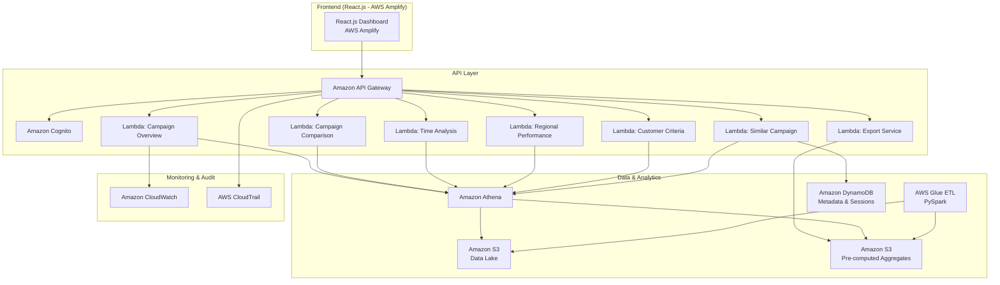
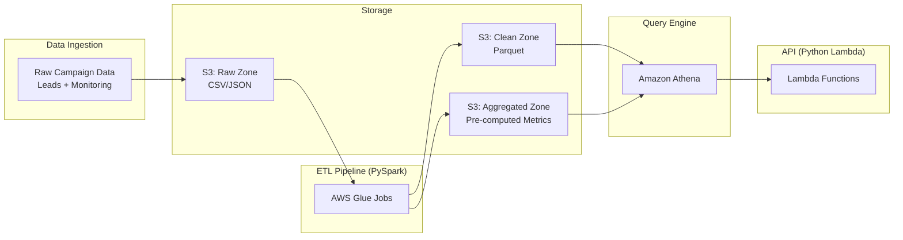
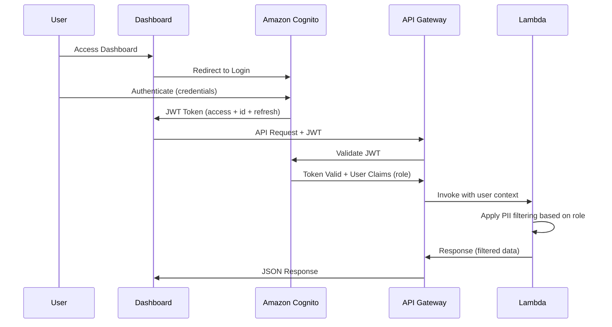
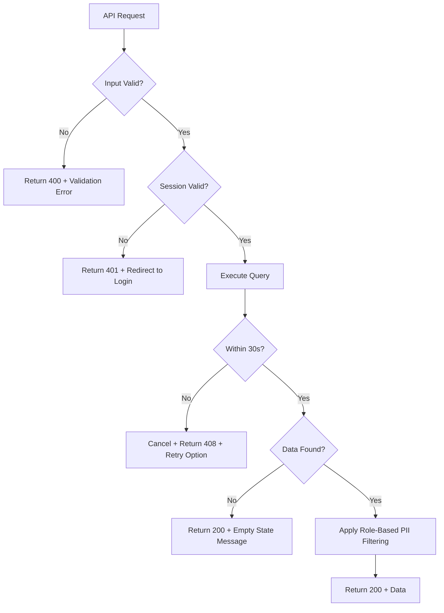

# Design Document: Campaign Insight Generator

## Overview

Campaign Insight Generator is an analytics dashboard that transforms historical marketing campaign data into actionable business intelligence. It enables Campaign Owners (Business Division) to compose criteria for new campaigns based on historical performance, and helps the Data Division monitor campaign effectiveness — reducing the lead provision SLA from ±3 days to ≤1 day by minimizing request revisions through data-driven insights.

The system follows a serverless architecture on AWS, leveraging:
- **Frontend**: React.js (JavaScript/TypeScript) hosted on AWS Amplify for a responsive SPA dashboard
- **Backend**: Python (AWS Lambda with boto3) for scalable, event-driven API handlers
- **API Layer**: Amazon API Gateway for routing and request validation
- **Analytics Engine**: Amazon Athena for SQL queries over campaign data in S3
- **Data Lake**: Amazon S3 for storing campaign history, leads, monitoring reports, and knowledge store
- **ETL**: Python (AWS Glue with PySpark) for data transformation pipelines
- **Database**: Amazon DynamoDB for session/metadata, Amazon RDS for relational campaign data
- **Infrastructure**: AWS CDK (Python) for infrastructure-as-code
- **Testing**: pytest + Hypothesis for property-based testing
- **AI/ML** (Future): Amazon Bedrock for AI recommendations, SageMaker for predictive scoring

### Design Decisions

1. **Serverless-first approach**: Lambda + API Gateway eliminates server management and scales automatically with usage patterns (dashboard traffic is bursty — high during business hours, low otherwise).
2. **Athena over RDS for analytics**: Campaign data is predominantly read-heavy and append-only. Athena's pay-per-query model on S3 data is cost-effective for analytical queries over large historical datasets.
3. **S3 as single source of truth**: All raw campaign data lands in S3 (data lake pattern), enabling multiple consumers (Athena, Glue, future ML models) without data duplication.
4. **Pre-computed aggregates**: Frequently accessed metrics (take up rates, regional summaries) are pre-computed by Glue jobs and stored as Parquet files to meet the <5 second response SLA.
5. **Role-based access with Cognito**: Amazon Cognito provides authentication with built-in user pool management and JWT-based session handling aligned with the 8-hour session requirement.
6. **Python backend**: Python with boto3 provides native AWS SDK integration, aligns with the Glue ETL stack (PySpark), and enables a unified Python ecosystem across backend, ETL, infrastructure (CDK), and testing (pytest + Hypothesis).
7. **Monorepo structure**: `frontend/` (React.js) and `backend/` (Python Lambda functions + CDK) provide clear separation while sharing the same repository for atomic deployments.

---

## Architecture

### High-Level System Architecture



### Data Flow Architecture



### Authentication & Authorization Flow



### Monorepo Structure

```
campaign-insight-generator/
├── frontend/                    # React.js (TypeScript) - AWS Amplify
│   ├── src/
│   │   ├── components/
│   │   ├── pages/
│   │   ├── services/
│   │   └── hooks/
│   ├── package.json
│   └── tsconfig.json
├── backend/                     # Python - Lambda + CDK
│   ├── lambdas/
│   │   ├── campaign_overview/
│   │   │   ├── handler.py
│   │   │   └── __init__.py
│   │   ├── campaign_comparison/
│   │   │   ├── handler.py
│   │   │   └── __init__.py
│   │   ├── time_analysis/
│   │   │   ├── handler.py
│   │   │   └── __init__.py
│   │   ├── regional_performance/
│   │   │   ├── handler.py
│   │   │   └── __init__.py
│   │   ├── customer_criteria/
│   │   │   ├── handler.py
│   │   │   └── __init__.py
│   │   ├── similar_campaign/
│   │   │   ├── handler.py
│   │   │   └── __init__.py
│   │   └── export_service/
│   │       ├── handler.py
│   │       └── __init__.py
│   ├── shared/
│   │   ├── models.py            # Shared dataclasses
│   │   ├── filters.py           # Filter logic
│   │   ├── calculations.py      # Metric calculations
│   │   ├── pii_filter.py        # PII removal
│   │   └── athena_client.py     # Athena query helper
│   ├── infrastructure/
│   │   ├── app.py               # CDK app entry point
│   │   ├── stacks/
│   │   │   ├── api_stack.py
│   │   │   ├── data_stack.py
│   │   │   └── auth_stack.py
│   │   └── cdk.json
│   ├── tests/
│   │   ├── unit/
│   │   ├── property/            # Hypothesis property tests
│   │   └── integration/
│   ├── glue_jobs/
│   │   ├── raw_to_clean.py
│   │   ├── aggregate_metrics.py
│   │   ├── similarity_index.py
│   │   └── regional_rollup.py
│   ├── requirements.txt
│   ├── requirements-dev.txt
│   └── pyproject.toml
└── README.md
```

---

## Components and Interfaces

### Frontend Components

| Component | Responsibility |
|-----------|---------------|
| `DashboardLayout` | Main layout with navigation, header, and filter sidebar |
| `CampaignOverviewPage` | Displays aggregate metrics with time-series trend chart |
| `CampaignComparisonPage` | Multi-campaign comparison with table and bar charts |
| `TimeToTakeUpPage` | Histogram and statistics for take-up timing analysis |
| `RegionalPerformancePage` | Regional breakdown with ranked table and trend charts |
| `CustomerCriteriaPage` | Demographic/financial distribution charts and comparisons |
| `SimilarCampaignPage` | Similar campaign finder with side-by-side comparison |
| `ExportService` | Client-side export trigger and download management |
| `FilterPanel` | Shared campaign filter component (period, product, region, channel) |
| `AuthGuard` | Route protection and session management |

### API Endpoints

| Endpoint | Method | Description |
|----------|--------|-------------|
| `/api/campaigns/overview` | GET | Campaign overview metrics with filter params |
| `/api/campaigns/comparison` | POST | Compare selected campaigns (body: campaign IDs) |
| `/api/campaigns/time-analysis/{id}` | GET | Time-to-take-up data for a campaign |
| `/api/campaigns/regional/{id}` | GET | Regional performance for a campaign |
| `/api/campaigns/customer-criteria/{id}` | GET | Customer criteria analysis for a campaign |
| `/api/campaigns/similar` | POST | Find similar campaigns (body: reference + dimensions) |
| `/api/export` | POST | Generate export file (body: page, filters, format) |
| `/api/auth/session` | GET | Validate session and get user info |

### Lambda Functions (Python)

```python
from dataclasses import dataclass, field
from typing import Optional, Literal
from datetime import date


# --- Campaign Overview Lambda ---

@dataclass
class CampaignOverviewRequest:
    start_date: str                          # ISO date string
    end_date: str                            # ISO date string
    products: Optional[list[str]] = None     # Product filter
    sub_products: Optional[list[str]] = None # Sub-product filter
    channels: Optional[list[str]] = None     # Channel filter
    regions: Optional[list[str]] = None      # Region filter


@dataclass
class TrendDataPoint:
    period_start: str
    period_end: str
    take_up_rate: float
    total_leads: int
    total_take_up: int


@dataclass
class ActiveFilter:
    field: str
    values: list[str]


@dataclass
class CampaignOverviewResponse:
    total_leads: int
    total_take_up: int
    take_up_rate: float                      # Percentage (0-100)
    total_campaigns: int
    trend: list[TrendDataPoint]              # Time-series data
    filters: list[ActiveFilter]


# --- Campaign Comparison Lambda ---

@dataclass
class CampaignComparisonRequest:
    campaign_ids: list[str]                  # 2-5 campaign IDs
    group_by: Optional[Literal['product', 'region', 'channel']] = None


@dataclass
class CampaignMetric:
    campaign_id: str
    campaign_name: str
    total_leads: int
    total_take_up: int
    take_up_rate: float
    total_transaction_value: float
    duration_days: int


@dataclass
class CampaignComparisonResponse:
    campaigns: list[CampaignMetric]
    comparison_chart: dict                   # Chart.js compatible data


# --- Similar Campaign Lambda ---

@dataclass
class SimilarCampaignRequest:
    reference_campaign_id: str
    dimensions: list[Literal['product', 'segment', 'region', 'channel']]
    limit: Optional[int] = None              # max 20


@dataclass
class SimilarCampaignResult:
    campaign_id: str
    campaign_name: str
    matching_dimensions: list[str]
    dimension_count: int
    similarity_score: float
    take_up_rate: float
    total_leads: int
    total_take_up: int


@dataclass
class SimilarCampaignResponse:
    similar_campaigns: list[SimilarCampaignResult]


# --- Export Lambda ---

@dataclass
class ExportRequest:
    page: str
    format: Literal['pdf', 'excel', 'csv']
    filters: list[ActiveFilter]
    time_range_start: str
    time_range_end: str


@dataclass
class ExportResponse:
    status: Literal['completed', 'timeout', 'error']
    download_url: Optional[str] = None
    error_message: Optional[str] = None
```

### Glue ETL Jobs (PySpark)

| Job Name | Schedule | Input | Output |
|----------|----------|-------|--------|
| `campaign-raw-to-clean` | Daily 02:00 | S3 Raw Zone (CSV/JSON) | S3 Clean Zone (Parquet) |
| `campaign-aggregate-metrics` | Daily 03:00 | S3 Clean Zone | S3 Aggregated Zone |
| `campaign-similarity-index` | Weekly Sun 04:00 | S3 Clean Zone | DynamoDB similarity table |
| `campaign-regional-rollup` | Daily 03:30 | S3 Clean Zone | S3 Aggregated Zone |

---

## Data Models

### Campaign Table (Athena - Parquet on S3)

```sql
CREATE EXTERNAL TABLE campaign (
    campaign_id         STRING,
    campaign_name       STRING,
    product             STRING,
    sub_product         STRING,
    segment             STRING,
    channel             STRING,
    region              STRING,
    start_date          DATE,
    end_date            DATE,
    total_leads         BIGINT,
    total_take_up       BIGINT,
    take_up_rate        DOUBLE,
    total_transaction_value DOUBLE,
    status              STRING,
    created_at          TIMESTAMP,
    updated_at          TIMESTAMP
)
PARTITIONED BY (year INT, month INT)
STORED AS PARQUET
LOCATION 's3://campaign-datalake/clean/campaigns/';
```

### Leads Table (Athena - Parquet on S3)

```sql
CREATE EXTERNAL TABLE leads (
    lead_id             STRING,
    campaign_id         STRING,
    distribution_date   DATE,
    take_up_date        DATE,
    take_up_flag        BOOLEAN,
    time_to_take_up_days INT,
    channel             STRING,
    region              STRING,
    -- Customer attributes (aggregated, no PII)
    customer_segment    STRING,
    age_group           STRING,
    domicile_region     STRING,
    product_holding     STRING,
    balance_category    STRING,
    transaction_value   DOUBLE
)
PARTITIONED BY (campaign_id STRING)
STORED AS PARQUET
LOCATION 's3://campaign-datalake/clean/leads/';
```

### Pre-computed Aggregates (Athena - Parquet on S3)

```sql
-- Campaign Overview Aggregates
CREATE EXTERNAL TABLE campaign_overview_agg (
    period_start        DATE,
    period_end          DATE,
    granularity         STRING,  -- 'weekly' or 'monthly'
    product             STRING,
    channel             STRING,
    region              STRING,
    total_leads         BIGINT,
    total_take_up       BIGINT,
    take_up_rate        DOUBLE,
    total_transaction_value DOUBLE,
    campaign_count      INT
)
STORED AS PARQUET
LOCATION 's3://campaign-datalake/aggregated/overview/';

-- Regional Performance Aggregates
CREATE EXTERNAL TABLE regional_performance_agg (
    campaign_id         STRING,
    region              STRING,
    week_start          DATE,
    leads_count         BIGINT,
    take_up_count       BIGINT,
    take_up_rate        DOUBLE,
    avg_transaction_value DOUBLE
)
STORED AS PARQUET
LOCATION 's3://campaign-datalake/aggregated/regional/';
```

### Campaign Similarity Index (DynamoDB)

```json
{
    "TableName": "CampaignSimilarityIndex",
    "KeySchema": [
        { "AttributeName": "campaign_id", "KeyType": "HASH" },
        { "AttributeName": "similar_campaign_id", "KeyType": "RANGE" }
    ],
    "Attributes": {
        "campaign_id": "STRING",
        "similar_campaign_id": "STRING",
        "matching_dimensions": "LIST<STRING>",
        "dimension_count": "NUMBER",
        "similarity_score": "NUMBER",
        "similar_campaign_take_up_rate": "NUMBER"
    },
    "GSI": [
        {
            "IndexName": "DimensionCountIndex",
            "KeySchema": [
                { "AttributeName": "campaign_id", "KeyType": "HASH" },
                { "AttributeName": "dimension_count", "KeyType": "RANGE" }
            ]
        }
    ]
}
```

### Audit Log (DynamoDB)

```json
{
    "TableName": "AuditLog",
    "KeySchema": [
        { "AttributeName": "user_id", "KeyType": "HASH" },
        { "AttributeName": "timestamp", "KeyType": "RANGE" }
    ],
    "Attributes": {
        "user_id": "STRING",
        "timestamp": "STRING (ISO 8601)",
        "page_accessed": "STRING",
        "action": "STRING",
        "request_params": "MAP",
        "ip_address": "STRING"
    },
    "TTL": {
        "AttributeName": "expiry_timestamp",
        "Enabled": true
    }
}
```

### User Session (Cognito + DynamoDB)

```json
{
    "TableName": "UserSessions",
    "KeySchema": [
        { "AttributeName": "session_id", "KeyType": "HASH" }
    ],
    "Attributes": {
        "session_id": "STRING",
        "user_id": "STRING",
        "role": "STRING (divisi_bisnis | divisi_data)",
        "login_timestamp": "STRING (ISO 8601)",
        "expiry_timestamp": "NUMBER (epoch + 8hrs)",
        "is_active": "BOOLEAN"
    }
}
```

---

## Correctness Properties

*A property is a characteristic or behavior that should hold true across all valid executions of a system — essentially, a formal statement about what the system should do. Properties serve as the bridge between human-readable specifications and machine-verifiable correctness guarantees.*

### Property 1: Take-Up Rate Calculation Correctness

*For any* set of campaign leads where total_leads > 0, the computed take_up_rate SHALL always equal `(total_take_up ÷ total_leads) × 100`, and this holds whether computed at the aggregate level, per-region level, or per-attribute-value level.

**Validates: Requirements 1.1, 4.1, 5.4**

### Property 2: Filter Correctness

*For any* campaign dataset and *any* single filter (product, sub-product, channel, or region), every item in the filtered result set SHALL match the applied filter value, and no item outside the filter match SHALL appear in the result.

**Validates: Requirements 1.3, 1.4, 3.3, 3.4, 4.4, 6.2**

### Property 3: Combined Filters Use AND Logic

*For any* campaign dataset and *any* combination of two or more filters applied simultaneously, the result set SHALL equal the intersection of applying each filter independently — meaning every item in the result satisfies ALL active filters.

**Validates: Requirements 1.5**

### Property 4: Time-Series Granularity Selection

*For any* selected date range, the system SHALL use weekly granularity when the period is ≤ 90 days and monthly granularity when the period is > 90 days.

**Validates: Requirements 1.7**

### Property 5: Campaign Selection Validation

*For any* campaign comparison request, the system SHALL accept exactly 2 to 5 campaigns (inclusive) and reject any selection with fewer than 2 or more than 5 campaigns.

**Validates: Requirements 2.3, 2.5**

### Property 6: Comparison Completeness

*For any* set of 2–5 selected campaigns, the comparison output SHALL contain all five required metrics (total leads, total take up, take up rate, total transaction value, campaign duration) for each campaign.

**Validates: Requirements 2.1**

### Property 7: Sorting Correctness

*For any* dataset to be sorted, when ascending sort is requested by a grouping attribute the output SHALL be ordered ascending by that attribute, and when sorted by take_up_rate descending (regional performance), each element's take_up_rate SHALL be ≥ the next element's take_up_rate.

**Validates: Requirements 2.4, 4.2**

### Property 8: Time-to-Take-Up Calculation

*For any* lead with a distribution_date and a take_up_date, the computed time_to_take_up_days SHALL equal the number of calendar days between distribution_date and take_up_date (inclusive of start, exclusive of end).

**Validates: Requirements 3.1**

### Property 9: Statistical Computation Correctness

*For any* non-empty array of time_to_take_up_days values, the computed statistics SHALL satisfy: minimum ≤ median ≤ maximum, mean = sum of values ÷ count of values, and minimum = smallest value in the array.

**Validates: Requirements 3.2**

### Property 10: Distribution Percentages Sum to 100%

*For any* set of leads grouped by a categorical attribute (segment, age_group, domicile_region, product_holding, balance_category), the sum of percentage values across all groups SHALL equal 100% (within ±0.01% floating point tolerance), and this holds separately for both take-up and non-take-up partitions.

**Validates: Requirements 5.1, 5.2, 5.3**

### Property 11: Similar Campaign Ranking

*For any* reference campaign and set of historical campaigns, the similar campaigns result SHALL contain at most 20 items, be sorted by dimension_count descending, and for campaigns with equal dimension_count, be sorted by take_up_rate descending.

**Validates: Requirements 6.1**

### Property 12: Similar Campaign Learning Summary Accuracy

*For any* campaign, the learning summary SHALL display take_up_rate formatted to exactly 2 decimal places, the segment with the highest take-up count as the "top segment", and the region with the highest absolute take-up count as the "top region".

**Validates: Requirements 6.4**

### Property 13: Session Expiry Enforcement

*For any* user session, the session SHALL expire exactly 8 hours (28,800 seconds) after the login timestamp, and any request made after expiry SHALL be rejected.

**Validates: Requirements 7.2**

### Property 14: PII Never Exposed

*For any* API response to *any* authenticated user (regardless of role), the response payload SHALL never contain individual PII fields: nama lengkap, nomor rekening, nomor identitas, or alamat lengkap.

**Validates: Requirements 7.5, 7.6**

### Property 15: Audit Log Completeness

*For any* user access event, the system SHALL create an audit log entry containing: user_id, timestamp (ISO 8601), and page_accessed — with no field being null or empty.

**Validates: Requirements 7.4**

### Property 16: Export Data Integrity

*For any* export request with active filters, the exported dataset SHALL contain exactly the same records as the filtered dashboard view — no additional records and no missing records.

**Validates: Requirements 8.1**

### Property 17: Export Metadata Presence

*For any* successfully generated export file, the file SHALL contain metadata including: active filter names, selected time range, and source page name.

**Validates: Requirements 8.2**

---

## Error Handling

### Error Categories and Responses

| Category | Trigger | User-Facing Response | System Action |
|----------|---------|---------------------|---------------|
| Empty Data | Filter yields no results | Informational message with active filters listed | Log as INFO, return 200 with empty data + message |
| Invalid Input | Selection > 5 campaigns, invalid date range | Validation error with guidance | Reject at API Gateway, return 400 |
| Query Timeout | Athena query exceeds 30s | Timeout message with retry option | Cancel query, log as WARN, return 408 |
| Export Failure | File generation fails | Error message with cause + retry | Log as ERROR, cleanup partial files, return 500 |
| Auth Expired | Session > 8 hours | Redirect to login with session expired message | Return 401, invalidate session |
| Service Unavailable | Athena/S3/DynamoDB down | Generic service error with retry | Circuit breaker, log as CRITICAL, return 503 |
| Rate Limited | Too many requests | Throttle message with wait time | Return 429 with Retry-After header |

### Error Handling Strategy



### Retry and Circuit Breaker Policy

- **Retryable errors**: Timeout (408), Service Unavailable (503)
- **Max retries**: 3 attempts with exponential backoff (1s, 2s, 4s)
- **Circuit breaker**: Opens after 5 consecutive failures, half-open after 30s
- **Non-retryable**: Validation errors (400), Auth errors (401), Rate limit (429)

### Export-Specific Error Handling

1. Export starts → 30-second timer begins
2. If completed within 30s → trigger download + success notification
3. If not completed within 30s → cancel export, show timeout message, offer retry
4. If technical failure → show error cause, cleanup, offer retry
5. Partial file cleanup: Lambda deletes any incomplete S3 objects on failure

---

## Testing Strategy

### Testing Approach

The Campaign Insight Generator uses a **dual testing approach**:
- **Property-based tests** (Hypothesis) for universal correctness properties (data calculations, filtering logic, sorting, validation rules)
- **Unit tests** (pytest) for specific examples, edge cases, and component behavior
- **Integration tests** for AWS service interactions and end-to-end flows

### Property-Based Testing

**Library**: [Hypothesis](https://hypothesis.readthedocs.io/) (Python)

**Configuration**:
- Minimum 100 iterations per property test (`@settings(max_examples=100)`)
- Each property test references its design document property
- Tag format: `Feature: campaign-insight-generator, Property {number}: {property_text}`

**Example Property Test Structure**:

```python
from hypothesis import given, settings, assume
from hypothesis import strategies as st
import pytest


# Feature: campaign-insight-generator, Property 1: Take-Up Rate Calculation Correctness
@given(
    total_leads=st.integers(min_value=1, max_value=1_000_000),
    total_take_up=st.integers(min_value=0),
)
@settings(max_examples=100)
def test_take_up_rate_calculation(total_leads: int, total_take_up: int):
    assume(total_take_up <= total_leads)
    rate = calculate_take_up_rate(total_leads, total_take_up)
    expected = (total_take_up / total_leads) * 100
    assert abs(rate - expected) < 0.0001


# Feature: campaign-insight-generator, Property 5: Campaign Selection Validation
@given(
    num_campaigns=st.integers(min_value=0, max_value=10),
)
@settings(max_examples=100)
def test_campaign_selection_validation(num_campaigns: int):
    campaign_ids = [f"campaign_{i}" for i in range(num_campaigns)]
    if 2 <= num_campaigns <= 5:
        assert validate_campaign_selection(campaign_ids) is True
    else:
        with pytest.raises(ValidationError):
            validate_campaign_selection(campaign_ids)
```

**Property Tests to Implement**:

| Property | What's Generated (Hypothesis strategies) | What's Verified |
|----------|------------------------------------------|-----------------|
| P1: Take-up rate | `st.integers` for leads/take-up counts (>0) | Rate = (take_up / leads) × 100 |
| P2: Filter correctness | `st.lists` of campaign dicts + `st.sampled_from` filter values | All results match filter |
| P3: AND logic | `st.lists` of campaigns + `st.lists` of filter combos | Result = intersection |
| P4: Granularity | `st.dates` for random date ranges | ≤90d → weekly, >90d → monthly |
| P5: Selection validation | `st.integers(0, 10)` for campaign count | Accept 2-5, reject others |
| P6: Comparison completeness | `st.lists(st.fixed_dictionaries(...), min_size=2, max_size=5)` | All 5 metrics present per campaign |
| P7: Sorting | `st.lists(st.floats(...))` + sort direction | Output is correctly ordered |
| P8: Time-to-take-up | `st.dates` for random date pairs | Days = date difference |
| P9: Statistics | `st.lists(st.integers(...), min_size=1)` | min ≤ median ≤ max, mean = sum/count |
| P10: Distributions | `st.lists` of grouped data dicts | Percentages sum to 100% ±0.01 |
| P11: Similar ranking | `st.lists` of campaign dicts + dimensions | ≤20 items, sorted by dimension_count desc, tiebreak by rate |
| P12: Learning summary | Random campaign data with `st.fixed_dictionaries` | Correct top segment, top region, 2-decimal rate |
| P13: Session expiry | `st.datetimes` for login timestamps | Expires at login + 8h exactly |
| P14: PII exclusion | `st.fixed_dictionaries` with PII fields | No PII in output |
| P15: Audit log | `st.fixed_dictionaries` for access events | All required fields present and non-empty |
| P16: Export integrity | `st.lists` of filtered datasets | Export content = filtered data |
| P17: Export metadata | `st.fixed_dictionaries` for export requests | Metadata fields present |

### Unit Tests (pytest - Example-Based)

| Area | Test Cases |
|------|-----------|
| Campaign Overview | Default 3-month period loads correctly; empty state displays message |
| Campaign Comparison | Bar chart data structure; max 5 validation message |
| Regional Performance | 8-week trend for selected region; empty region handling |
| Similar Campaign | Side-by-side structure includes all 4 sections; no similar found message |
| Authentication | Unauthenticated redirect; role claim extraction |
| Export | PDF generation format; CSV delimiter; timeout handling |
| Error States | All 7 error category responses |

### Integration Tests

| Area | Test Cases |
|------|-----------|
| Athena Queries | Campaign overview query returns expected schema; filter parameters bind correctly |
| Cognito Auth | Login flow; token refresh; session invalidation after 8h |
| S3 Export | File written to S3; presigned URL generation; cleanup on failure |
| DynamoDB | Audit log write; similarity index query; session CRUD |
| Glue ETL | Raw-to-clean transformation; aggregate computation |
| API Gateway | Request validation; CORS; rate limiting |

### Test Environment

- **Unit/Property tests**: Run locally with mocked AWS services (moto library for boto3 mocking)
- **Integration tests**: Run against AWS dev environment with isolated resources
- **CI/CD**: Property and unit tests (`pytest`) on every PR; integration tests on merge to main
- **Dependencies**: `requirements-dev.txt` includes `pytest`, `hypothesis`, `moto[all]`, `pytest-cov`, `pytest-mock`
