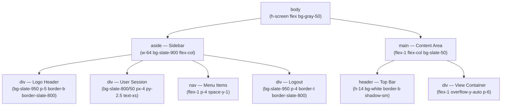
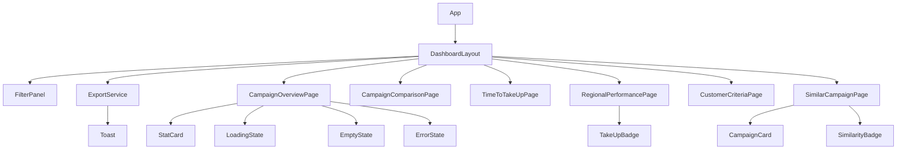
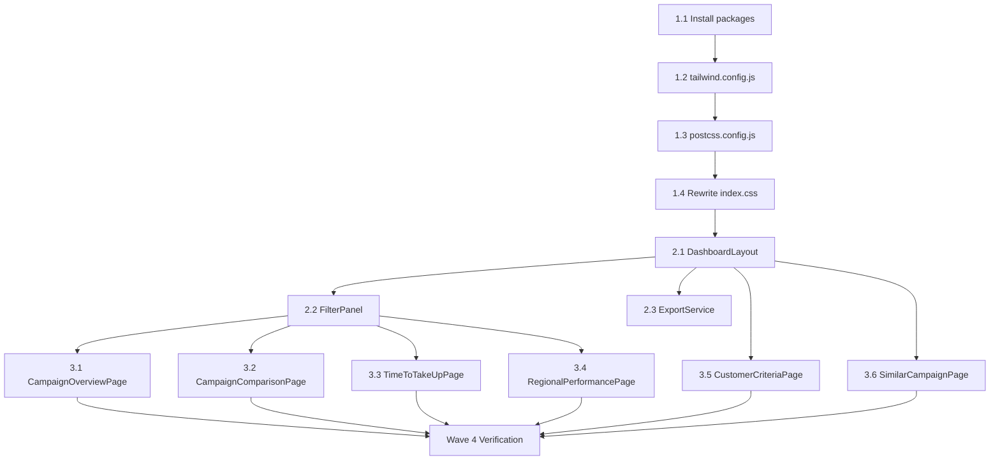

# Design Document — UI Redesign (BNI Design System)

## Overview

Dokumen ini mendefinisikan desain teknis untuk refactor menyeluruh frontend Campaign Insight Generator agar sesuai dengan BNI Design System. Refactor mencakup: instalasi Tailwind CSS 3.4.1 + Lucide React 0.378.0 ke dalam project Create React App berbasis PostCSS, penghapusan 9 file CSS komponen, penggantian semua emoji dengan Lucide React icons, konversi semua inline styles ke Tailwind utility classes, dan penerapan token desain BNI secara konsisten (BNI Teal `#005E6A`, BNI Orange `#F15A24`, sidebar gelap `bg-slate-900`) di seluruh 6 halaman dan 3 komponen bersama.

Hasil akhirnya adalah codebase tanpa CSS file per-komponen, tanpa emoji, tanpa `style={}` kecuali untuk konfigurasi Chart.js — seluruh styling dilakukan melalui Tailwind utility classes dan dua file global: `tailwind.config.js` dan `src/index.css`.

---

## Architecture

### Tailwind CSS Integration dengan Create React App (PostCSS Pipeline)

Create React App (CRA) 5.x sudah menyertakan PostCSS pipeline bawaan. Tailwind CSS 3.x beroperasi sebagai PostCSS plugin, sehingga tidak memerlukan `craco` atau ejecting.

**Dependency install:**
```bash
npm install tailwindcss@3.4.1 lucide-react@0.378.0
npm install --save-dev autoprefixer@10.4.19 postcss@8.4.38
npx tailwindcss init -p
```

Flag `-p` pada `tailwindcss init` menghasilkan `tailwind.config.js` DAN `postcss.config.js` secara bersamaan.

**PostCSS pipeline flow:**
```
src/index.css (@tailwind directives)
    → PostCSS reads postcss.config.js
    → tailwindcss plugin: scans content paths, generates utility classes
    → autoprefixer plugin: adds vendor prefixes
    → CRA injects processed CSS into the bundle
```

CRA secara otomatis membaca `postcss.config.js` di root project karena menggunakan `postcss-loader`. Tidak diperlukan konfigurasi tambahan pada CRA itu sendiri.

### Dependency Strategy

Pinned exact versions (no ranges) sesuai requirements:

```json
"dependencies": {
  "lucide-react": "0.378.0",
  "tailwindcss": "3.4.1"
},
"devDependencies": {
  "autoprefixer": "10.4.19",
  "postcss": "8.4.38"
}
```


---

## Components and Interfaces

### Shell Layout — Mermaid Diagram



### Component Hierarchy




---

## File Change Inventory

### Files to CREATE

| File | Purpose |
|------|---------|
| `frontend/tailwind.config.js` | Tailwind config dengan BNI color tokens dan Inter font |
| `frontend/postcss.config.js` | PostCSS config untuk CRA pipeline |

### Files to MODIFY

| File | What Changes |
|------|-------------|
| `frontend/package.json` | Tambah `tailwindcss`, `lucide-react`, `autoprefixer`, `postcss` |
| `frontend/src/index.css` | Ganti isi dengan Tailwind directives + Google Fonts + custom classes |
| `frontend/src/components/DashboardLayout.tsx` | Full rewrite: emoji→Lucide, CSS→Tailwind, sidebar dark shell |
| `frontend/src/components/FilterPanel.tsx` | Full rewrite: CSS→Tailwind, ▼▲→ChevronDown/Up |
| `frontend/src/components/ExportService.tsx` | Full rewrite: emoji→Lucide icons, Toast Tailwind classes |
| `frontend/src/pages/CampaignOverviewPage.tsx` | CSS→Tailwind, emoji→Lucide, Stat Card pattern |
| `frontend/src/pages/CampaignComparisonPage.tsx` | Remove `styles` object, convert all to Tailwind |
| `frontend/src/pages/TimeToTakeUpPage.tsx` | CSS→Tailwind, emoji→Lucide, Stat Card pattern |
| `frontend/src/pages/RegionalPerformancePage.tsx` | Remove `styles` object, convert all to Tailwind, badge system |
| `frontend/src/pages/CustomerCriteriaPage.tsx` | CSS→Tailwind, emoji→Lucide, table wrapper |
| `frontend/src/pages/SimilarCampaignPage.tsx` | CSS→Tailwind, emoji→Lucide, card + badge pattern |

### Files to DELETE

| File | Reason |
|------|--------|
| `frontend/src/components/DashboardLayout.css` | Replaced by Tailwind |
| `frontend/src/components/FilterPanel.css` | Replaced by Tailwind |
| `frontend/src/components/ExportService.css` | Replaced by Tailwind |
| `frontend/src/pages/CampaignOverviewPage.css` | Replaced by Tailwind |
| `frontend/src/pages/CampaignComparisonPage.css` | Replaced by Tailwind |
| `frontend/src/pages/TimeToTakeUpPage.css` | Replaced by Tailwind |
| `frontend/src/pages/RegionalPerformancePage.css` | Replaced by Tailwind |
| `frontend/src/pages/CustomerCriteriaPage.css` | Replaced by Tailwind |
| `frontend/src/pages/SimilarCampaignPage.css` | Replaced by Tailwind |


---

## Data Models

### Config Files

**`frontend/tailwind.config.js`** (complete content):
```js
/** @type {import('tailwindcss').Config} */
module.exports = {
  content: ['./src/**/*.{ts,tsx}'],
  theme: {
    extend: {
      colors: {
        'bni-teal': '#005E6A',
        'bni-orange': '#F15A24',
      },
      fontFamily: {
        sans: ['Inter', 'sans-serif'],
      },
    },
  },
  plugins: [],
};
```

**`frontend/postcss.config.js`** (complete content):
```js
module.exports = {
  plugins: {
    tailwindcss: {},
    autoprefixer: {},
  },
};
```

### TypeScript Interfaces (Unchanged)

The refactor is styling-only. Existing TypeScript interfaces (`DashboardLayoutProps`, `ExportServiceProps`, `FilterPanelProps`, and all API types) remain unchanged.

### New Sub-component Interfaces

```tsx
// Shared StatCard — used by CampaignOverviewPage and TimeToTakeUpPage
interface StatCardProps {
  label: string;
  value: string;
  icon: React.ReactNode; // Lucide React component
}

// TakeUpBadge — used by RegionalPerformancePage
interface TakeUpBadgeProps {
  rate: number;
  label: string; // formatted "12.34%"
}

// SimilarityBadge — used by SimilarCampaignPage
interface SimilarityBadgeProps {
  score: number; // 0–1
}

// Toast (internal to ExportService)
type ToastType = 'success' | 'warning' | 'error';
interface ToastState {
  message: string;
  type: ToastType;
}
```


---

## Component Designs

### 1. DashboardLayout Refactor

**Current:** custom CSS classes from `DashboardLayout.css`, emoji icons in `navItems`, horizontal header bar at top.

**New:** BNI Design System shell — vertical sidebar-left layout, dark sidebar, top bar on the right content column.

**Key structural change:** The current layout uses a **horizontal** top header + sidebar-below pattern. The new layout uses **sidebar-left + content-right** (matching the BNI design system shell spec).

#### `navItems` array (emoji → Lucide):
```tsx
import {
  LayoutGrid, GitCompareArrows, Clock,
  MapPin, Users, Search, LogOut
} from 'lucide-react';

const navItems = [
  { path: '/overview',          label: 'Campaign Overview',     Icon: LayoutGrid },
  { path: '/comparison',        label: 'Perbandingan Campaign', Icon: GitCompareArrows },
  { path: '/time-analysis',     label: 'Time to Take Up',       Icon: Clock },
  { path: '/regional',          label: 'Performa Regional',     Icon: MapPin },
  { path: '/customer-criteria', label: 'Kriteria Nasabah',      Icon: Users },
  { path: '/similar-campaigns', label: 'Campaign Serupa',       Icon: Search },
];
```

#### Tailwind class specification:

| Element | Tailwind Classes |
|---------|-----------------|
| Root wrapper | `h-screen flex bg-gray-50 overflow-hidden` |
| Sidebar `<aside>` | `w-64 flex-shrink-0 bg-slate-900 flex flex-col` |
| Logo header div | `bg-slate-950 px-5 py-4 border-b border-slate-800` |
| Logo text | `text-sm font-bold text-white` |
| Logo subtext (BNI) | `text-[10px] text-[#F15A24] font-semibold uppercase tracking-wider` |
| User session div | `bg-slate-800/50 px-4 py-2.5` |
| User session text | `text-xs text-slate-400` |
| Username | `text-xs font-medium text-slate-300` |
| Nav `<nav>` | `flex-1 p-4 space-y-1` |
| Nav item — inactive | `w-full flex items-center space-x-3 px-4 py-2.5 rounded-lg text-xs font-medium text-slate-400 hover:bg-slate-800 hover:text-white transition-colors` |
| Nav item — active | `w-full flex items-center space-x-3 px-4 py-2.5 rounded-lg text-xs font-semibold bg-[#005E6A] text-white` |
| Nav icon | `w-4 h-4 flex-shrink-0` |
| Logout container | `bg-slate-950 p-4 border-t border-slate-800` |
| Logout button | `w-full flex items-center space-x-3 px-4 py-2.5 rounded-lg text-xs font-medium text-slate-400 hover:bg-slate-800 hover:text-white transition-colors` |
| Content `<main>` | `flex-1 flex flex-col bg-slate-50 overflow-hidden` |
| Top bar `<header>` | `h-14 bg-white border-b border-gray-200 flex items-center justify-between px-6 flex-shrink-0 shadow-sm z-30` |
| Page title in top bar | `text-md font-bold text-gray-700 flex items-center space-x-2` |
| Title icon | `w-4 h-4 text-[#005E6A]` |
| View container | `flex-1 overflow-y-auto p-6` |


### 2. FilterPanel Refactor

**Current:** `FilterPanel.css` for all styling; collapse toggle shows `▼ Expand` / `▲ Collapse` text characters.

**New:** Tailwind-only, `ChevronDown`/`ChevronUp` Lucide icons for toggle.

#### Tailwind class specification:

| Element | Tailwind Classes |
|---------|-----------------|
| Aside container | `bg-white border border-gray-200 rounded-xl shadow-sm` |
| Panel header | `flex items-center justify-between px-4 py-3 border-b border-gray-100` |
| "Filter" title | `text-xs font-bold uppercase tracking-wider text-gray-600` |
| Toggle button | `flex items-center gap-1 text-xs text-gray-500 hover:text-gray-700` |
| Toggle icon | `w-4 h-4` |
| Panel body | `p-4 space-y-4` |
| `<fieldset>` | `space-y-2` |
| `<legend>` | `text-xs font-bold uppercase tracking-wider text-gray-600 mb-2` |
| Checkbox label | `flex items-center gap-2 text-xs text-gray-700 cursor-pointer` |
| Checkbox input | `rounded border-gray-300 text-[#005E6A] focus:ring-[#005E6A]` |
| Date input | `w-full px-3 py-2 border border-gray-300 rounded-lg focus:outline-none focus:ring-2 focus:ring-[#005E6A] bg-white text-xs` |
| Text input | `w-full px-3 py-2 border border-gray-300 rounded-lg focus:outline-none focus:ring-2 focus:ring-[#005E6A] bg-white text-xs` |
| Date label | `text-xs text-gray-600 font-medium` |
| Actions row | `flex gap-2 pt-2` |
| Reset button | `flex-1 px-4 py-2 bg-gray-100 hover:bg-gray-200 text-gray-700 font-semibold rounded-lg text-xs transition-colors` |
| Apply button | `flex-1 px-4 py-2 bg-[#005E6A] hover:bg-[#004852] text-white font-semibold rounded-lg text-xs transition-colors` |
| Checkbox grid | `grid grid-cols-2 gap-1.5` |


### 3. ExportService Refactor

**Current:** `ExportService.css` + emoji (`📥 ⏳ ✅ ⚠️ ❌ ✕`) in button text and toast messages.

**New:** Tailwind-only. Lucide icons (`Download`, `Loader2`, `CheckCircle`, `AlertCircle`, `XCircle`, `X`). Formal toast messages without exclamation marks.

#### Icon mapping:
| State/Action | Old | New |
|---|---|---|
| Export button idle | `📥 Export` | `<Download className="w-4 h-4" /> Export` |
| Export button loading | `⏳ Mengekspor...` | `<Loader2 className="w-4 h-4 animate-spin" /> Mengekspor` |
| Toast success | `✅ File siap diunduh!` | `<CheckCircle className="w-4 h-4" /> File siap diunduh` |
| Toast warning | `⚠️ Ekspor timeout...` | `<AlertCircle className="w-4 h-4" /> Ekspor timeout (>30 detik). Coba kurangi rentang data atau coba lagi` |
| Toast error | `❌ Ekspor gagal: ...` | `<XCircle className="w-4 h-4" /> Ekspor gagal: {cause}. Coba lagi` |
| Toast dismiss | `✕` | `<X className="w-3.5 h-3.5" />` |

#### Tailwind class specification:

| Element | Tailwind Classes |
|---------|-----------------|
| Export button (idle) | `flex items-center gap-2 px-4 py-2 bg-[#005E6A] hover:bg-[#004852] text-white font-semibold rounded-lg text-xs transition-colors` |
| Export button (loading) | `flex items-center gap-2 px-4 py-2 bg-[#005E6A]/70 text-white font-semibold rounded-lg text-xs cursor-not-allowed` |
| Export button (disabled) | `flex items-center gap-2 px-4 py-2 bg-gray-300 text-gray-500 font-semibold rounded-lg text-xs cursor-not-allowed` |
| Format select | `px-3 py-2 border border-gray-300 rounded-lg text-xs bg-white focus:ring-2 focus:ring-[#005E6A] focus:outline-none` |
| Button group wrapper | `flex items-center gap-2` |
| Toast container | `fixed bottom-5 right-5 max-w-sm space-y-2 z-50` |
| Toast base | `flex items-center gap-3 px-4 py-3 rounded-lg shadow-lg text-white text-xs font-medium` |
| Toast success | `bg-emerald-600` |
| Toast warning | `bg-amber-500` |
| Toast error | `bg-rose-600` |
| Toast message | `flex-1` |
| Toast dismiss button | `flex-shrink-0 opacity-80 hover:opacity-100 transition-opacity` |
| Toast retry button | `text-xs underline opacity-90 hover:opacity-100 whitespace-nowrap` |


---

## Page-by-Page Designs

### 4. CampaignOverviewPage

**Current:** `CampaignOverviewPage.css` + emoji icons (`👥 ✅ 📈 ⚠️ 📭`), CSS spinner, custom MetricCard component.

**New:** Tailwind-only. `StatCard` sub-component with Lucide icon. Standardized empty/error/loading states.

#### StatCard sub-component:
```tsx
interface StatCardProps {
  label: string;
  value: string;
  icon: React.ReactNode;
}

const StatCard: React.FC<StatCardProps> = ({ label, value, icon }) => (
  <div className="bg-white p-4 border border-gray-200 rounded-xl shadow-sm flex items-start gap-3">
    <div className="flex-shrink-0 text-[#005E6A]">{icon}</div>
    <div>
      <span className="text-xs font-medium text-slate-400 block">{label}</span>
      <span className="text-2xl font-bold text-slate-700">{value}</span>
    </div>
  </div>
);
```

#### Stat Cards usage:
```tsx
<StatCard label="Total Leads"  value={formatNumber(data.total_leads)}  icon={<Users className="w-5 h-5" />} />
<StatCard label="Total Take Up" value={formatNumber(data.total_take_up)} icon={<TrendingUp className="w-5 h-5" />} />
<StatCard label="Take Up Rate"  value={formatRate(data.take_up_rate)}   icon={<BarChart2 className="w-5 h-5" />} />
```

#### Tailwind class specification:

| Element | Tailwind Classes |
|---------|-----------------|
| Page root | `flex flex-col gap-4` |
| Header row | `flex items-center justify-between` |
| Page title (in Top Bar) | per DashboardLayout Top Bar spec |
| Response time badge — good | `inline-flex items-center gap-1 text-xs font-medium text-emerald-600` |
| Response time badge — slow | `inline-flex items-center gap-1 text-xs font-medium text-amber-600` |
| Stat cards grid | `grid grid-cols-3 gap-4` |
| Chart wrapper | `bg-white border border-gray-200 rounded-xl shadow-sm p-4` (height: `style={{ height: '320px' }}` — Chart.js exception) |
| Filter summary | `flex flex-wrap items-center gap-2 text-xs text-gray-500` |
| Filter tag | `bg-[#005E6A]/10 border border-[#005E6A]/30 text-[#005E6A] rounded px-2 py-0.5 text-xs font-medium` |
| Body layout | `flex gap-4` |
| Filter sidebar | `w-72 flex-shrink-0` |
| Main content | `flex-1 min-w-0 space-y-4` |

#### Response time badge icons:
- `responseMs < 5000` → `<CheckCircle className="w-3.5 h-3.5" />` + `text-emerald-600`
- `responseMs >= 5000` → `<AlertCircle className="w-3.5 h-3.5" />` + `text-amber-600`


### 5. CampaignComparisonPage

**Current:** Entire `styles` object of `React.CSSProperties` (30+ properties), `@keyframes spin` injected via `<style>`, `CampaignComparisonPage.css`.

**New:** All `style={...}` replaced by Tailwind classes. `animate-spin` from Tailwind replaces `@keyframes spin`.

#### Key replacements (old inline style → new Tailwind):

| Old `styles.*` | New Tailwind |
|---|---|
| `styles.container` | `p-6 max-w-[1200px]` |
| `styles.heading` | Rendered by DashboardLayout Top Bar |
| `styles.card` | `bg-white p-4 border border-gray-200 rounded-xl shadow-sm mb-4` |
| `styles.sectionTitle` | `text-xs font-bold uppercase tracking-wider text-gray-400 mb-3` |
| `styles.input` | `w-56 px-3 py-2 border border-gray-300 rounded-lg focus:outline-none focus:ring-2 focus:ring-[#005E6A] bg-white text-xs` |
| `styles.addButton` | `px-4 py-2 bg-[#005E6A] hover:bg-[#004852] text-white font-semibold rounded-lg text-xs transition-colors` |
| `styles.addButtonDisabled` | `px-4 py-2 bg-gray-300 text-gray-500 font-semibold rounded-lg text-xs cursor-not-allowed` |
| `styles.chip` | `inline-flex items-center gap-1.5 px-2.5 py-1 bg-[#005E6A]/20 border border-[#005E6A] text-[#005E6A] rounded-full text-xs font-medium` |
| `styles.chipRemove` | `hover:text-rose-600 transition-colors` |
| `styles.compareButton` | `px-6 py-2.5 bg-[#005E6A] hover:bg-[#004852] text-white font-semibold rounded-lg text-xs transition-colors` |
| `styles.compareButtonDisabled` | `px-6 py-2.5 bg-gray-300 text-gray-500 font-semibold rounded-lg text-xs cursor-not-allowed` |
| `styles.thCell` | `px-3 py-2.5 text-left bg-slate-900 text-white text-xs font-semibold whitespace-nowrap` |
| `styles.tdEven` | `px-3 py-2.5 bg-white border-b border-gray-100 text-xs` |
| `styles.tdOdd` | `px-3 py-2.5 bg-slate-50 border-b border-gray-100 text-xs` |
| `styles.spinnerContainer` | `flex justify-center items-center py-12 gap-3` |
| `styles.spinner` | Remove — use `<Loader2 className="w-8 h-8 animate-spin text-[#005E6A]" />` |
| `styles.emptyState` | Use shared EmptyState pattern |
| `styles.errorState` | Use shared ErrorState pattern |
| `styles.select` | `px-3 py-2 border border-gray-300 rounded-lg text-xs bg-white focus:ring-2 focus:ring-[#005E6A] focus:outline-none` |
| `styles.chartWrapper` | `relative` (height: `style={{ height: '420px' }}` — Chart.js exception) |
| `styles.chipRow` | `flex flex-wrap gap-2 mt-3` |
| `styles.inputRow` | `flex items-center gap-2 flex-wrap` |
| `styles.label` | `text-xs font-bold uppercase tracking-wider text-gray-600` |

Remove `<style>{@keyframes spin ...}</style>` entirely — Tailwind's `animate-spin` covers this.


### 6. TimeToTakeUpPage

**Current:** `TimeToTakeUpPage.css` + emoji icons + likely CSS spinner (structure mirrors CampaignOverviewPage).

**New:** Tailwind-only. StatCard pattern reused. Lucide icons `Clock` and `Timer` for stat cards.

#### Tailwind class specification:

| Element | Tailwind Classes |
|---------|-----------------|
| Page root | `flex flex-col gap-4` |
| Stat cards grid | `grid grid-cols-2 gap-4` |
| StatCard for rata-rata | `icon={<Clock className="w-5 h-5" />}` |
| StatCard for median | `icon={<Timer className="w-5 h-5" />}` |
| Chart wrapper | `bg-white border border-gray-200 rounded-xl shadow-sm p-4` (height: `style={{ height: '320px' }}`) |

Loading, error, and empty states: use shared patterns (see Shared Patterns section).

### 7. RegionalPerformancePage

**Current:** Entire `styles` object as `Record<string, React.CSSProperties>` (25+ properties), emoji state icons (`🗺️ 📭 ⚠️`), CSS spinner via `RegionalPerformancePage.css`.

**New:** All `style={}` replaced. Rate badge system as a pure function returning Tailwind class strings.

#### Rate badge function:
```tsx
function getTakeUpBadgeClasses(rate: number): string {
  if (rate >= 10) return 'bg-emerald-100 text-emerald-700 rounded px-1.5 py-0.5 text-xs font-semibold';
  if (rate >= 5)  return 'bg-amber-100 text-amber-700 rounded px-1.5 py-0.5 text-xs font-semibold';
  return 'bg-rose-100 text-rose-700 rounded px-1.5 py-0.5 text-xs font-semibold';
}
```

#### Key replacements:

| Old `styles.*` | New Tailwind |
|---|---|
| `styles.pageRoot` | `flex flex-col gap-4` |
| `styles.pageTitle` | Rendered by DashboardLayout Top Bar |
| `styles.card` | `bg-white p-4 border border-gray-200 rounded-xl shadow-sm` |
| `styles.sectionTitle` | `text-xs font-bold uppercase tracking-wider text-gray-400 mb-3` |
| `styles.filterRow` | `flex gap-4 flex-wrap items-end` |
| `styles.filterGroup` | `flex flex-col gap-1` |
| `styles.label` | `text-xs font-bold uppercase tracking-wider text-gray-600` |
| `styles.input` | `w-60 px-3 py-2 border border-gray-300 rounded-lg focus:outline-none focus:ring-2 focus:ring-[#005E6A] bg-white text-xs` |
| `styles.select` | `px-3 py-2 border border-gray-300 rounded-lg text-xs bg-white focus:ring-2 focus:ring-[#005E6A] focus:outline-none min-w-[200px]` |
| `styles.primaryButton` | `px-5 py-2 bg-[#005E6A] hover:bg-[#004852] text-white font-semibold rounded-lg text-xs transition-colors` |
| `styles.primaryButtonDisabled` | `px-5 py-2 bg-gray-300 text-gray-500 font-semibold rounded-lg text-xs cursor-not-allowed` |
| `styles.spinner` | Remove — use `<Loader2 className="w-8 h-8 animate-spin text-[#005E6A]" />` |
| `styles.thCell` | `px-3 py-2.5 text-left bg-slate-900 text-white text-xs font-semibold whitespace-nowrap` |
| `styles.tdEven` | `px-3 py-2.5 bg-white border-b border-gray-100 text-xs` |
| `styles.tdOdd` | `px-3 py-2.5 bg-slate-50 border-b border-gray-100 text-xs` |
| `styles.tdSelected` | `px-3 py-2.5 bg-[#005E6A]/10 border-b border-[#005E6A]/20 text-xs` |
| `styles.tableRow` | `cursor-pointer hover:bg-slate-50 transition-colors` |
| `styles.tableRowSelected` | `ring-2 ring-inset ring-[#005E6A]` |
| `styles.rateHigh` | `getTakeUpBadgeClasses(rate)` — emerald path |
| `styles.rateMid` | `getTakeUpBadgeClasses(rate)` — amber path |
| `styles.rateLow` | `getTakeUpBadgeClasses(rate)` — rose path |
| `styles.chartContainer` | `relative` (height: `style={{ height: '340px' }}`) |
| `styles.campaignBanner` | `flex items-center gap-2.5 px-4 py-2.5 bg-[#005E6A]/10 border border-[#005E6A]/30 rounded-lg flex-wrap` |
| `styles.programTag` | `bg-emerald-100 text-emerald-700 border border-emerald-200 rounded px-2 py-0.5 text-xs font-semibold` |
| Idle state icon `🗺️` | `<MapPin className="w-8 h-8 text-gray-300" />` |
| Empty state icon `📭` | `<Inbox className="w-8 h-8 text-gray-300" />` |
| Error state icon `⚠️` | `<AlertCircle className="w-8 h-8 text-rose-400" />` |


### 8. CustomerCriteriaPage

**Current:** `CustomerCriteriaPage.css` + emoji icons.

**New:** Tailwind-only. Table wrapper card, section headings, Lucide icons `Users` and `Filter`.

#### Tailwind class specification:

| Element | Tailwind Classes |
|---------|-----------------|
| Page root | `flex flex-col gap-4` |
| Table card wrapper | `bg-white border border-gray-200 rounded-xl shadow-sm overflow-hidden` |
| Section heading | `text-xs font-bold uppercase tracking-wider text-gray-400 mb-2` |
| Table `<table>` | `w-full text-xs` |
| Table header row | `bg-slate-900` |
| `<th>` cells | `px-3 py-2.5 text-left text-white font-semibold whitespace-nowrap` |
| `<td>` cells even | `px-3 py-2.5 bg-white border-b border-gray-100` |
| `<td>` cells odd | `px-3 py-2.5 bg-slate-50 border-b border-gray-100` |
| `<thead>` wrapper | `table-fixed-header` (custom class for sticky) |

### 9. SimilarCampaignPage

**Current:** `SimilarCampaignPage.css` + emoji (`⚠️ 🔍 📊 🔗 📐 ℹ️ 🏆`). The `CampaignCard` sub-component uses CSS classes from the CSS file.

**New:** Tailwind-only. CampaignCard refactored to Tailwind inline classes. Emoji replaced in `ComparisonView` section headings.

#### CampaignCard Tailwind classes:
```
Card container: bg-white p-4 border border-gray-200 rounded-xl shadow-sm hover:shadow-md transition-shadow cursor-pointer
Card selected:  bg-white p-4 border-2 border-[#005E6A] rounded-xl shadow-md cursor-pointer
Card header:    flex items-start justify-between gap-2 mb-2
Card name:      text-xs font-bold text-slate-700 truncate-2-lines
Card id:        text-[10px] text-slate-400 flex-shrink-0
Card metrics:   grid grid-cols-2 gap-2 mt-2
Card metric:    flex flex-col gap-0.5
Metric label:   text-[10px] text-slate-400 uppercase tracking-wider
Metric value:   text-sm font-bold text-slate-700
Metric score:   text-sm font-bold text-[#005E6A]
Badge container: flex flex-wrap gap-1 mt-2
```

#### Similarity score badge:
```tsx
<span className="bg-[#005E6A]/20 border border-[#005E6A] text-[#005E6A] text-xs font-semibold rounded px-1.5 py-0.5">
  {fmtScore(campaign.similarity_score)}
</span>
```

#### Dimension matching badge:
```tsx
<span className="bg-[#005E6A]/10 border border-[#005E6A]/40 text-[#005E6A] text-[10px] font-medium rounded px-1.5 py-0.5">
  {dim}
</span>
```

#### ComparisonView section headings (emoji → Lucide):
| Old | New |
|-----|-----|
| `📊 Metrik Utama` | `<BarChart2 className="w-3.5 h-3.5" /> Metrik Utama` |
| `🔗 Dimensi yang Cocok` | `<GitCompareArrows className="w-3.5 h-3.5" /> Dimensi yang Cocok` |
| `📐 Skor Kesamaan` | `<Star className="w-3.5 h-3.5" /> Skor Kesamaan` |
| `ℹ️ Data Lanjutan` | `<Info className="w-3.5 h-3.5" /> Data Lanjutan` |
| `🏆 Learning Summary` | `<TrendingUp className="w-3.5 h-3.5" /> Learning Summary` |

#### Empty/no-result state:
```tsx
<SearchX className="w-8 h-8 text-gray-300" /> — for no campaigns found
<Search className="w-8 h-8 text-gray-300" />  — for idle state
```


---

## Shared Patterns

### Empty State (Standardized)

Used in: all 6 pages when no data is available.

```tsx
const EmptyState: React.FC<{ message?: string; hint?: string }> = ({
  message = 'Tidak ada data tersedia',
  hint = 'Silakan sesuaikan filter untuk menampilkan data',
}) => (
  <div className="text-center py-12 text-gray-400">
    <Inbox className="w-8 h-8 mx-auto mb-2 text-gray-300" />
    <p className="text-sm font-medium">{message}</p>
    <p className="text-xs mt-1">{hint}</p>
  </div>
);
```

### Loading State (Standardized)

Used in: all 6 pages during API fetch.

```tsx
const LoadingState: React.FC<{ text?: string }> = ({
  text = 'Memuat data',
}) => (
  <div className="text-center py-12 text-gray-400">
    <Loader2 className="w-8 h-8 mx-auto mb-2 animate-spin text-[#005E6A]" />
    <p className="text-sm font-medium">{text}</p>
  </div>
);
```

### Error State (Standardized)

Used in: all 6 pages on API error.

```tsx
const ErrorState: React.FC<{ message: string }> = ({ message }) => (
  <div className="text-center py-12">
    <AlertCircle className="w-8 h-8 mx-auto mb-2 text-rose-400" />
    <p className="text-sm font-medium text-rose-600">Terjadi kesalahan</p>
    <p className="text-xs mt-1 text-gray-500">{message}</p>
  </div>
);
```

### Formal Status Text Rules

All status messages throughout the application must follow these rules:
- No emoji characters anywhere
- No exclamation marks (`!`)
- Use formal Bahasa Indonesia

| Context | Text |
|---------|------|
| Loading | `Memuat data` |
| Empty | `Tidak ada data tersedia` |
| Error generic | `Terjadi kesalahan` |
| Export success | `File siap diunduh` |
| Export timeout | `Ekspor timeout (>30 detik). Coba kurangi rentang data atau coba lagi` |
| Export error | `Ekspor gagal: {cause}. Coba lagi` |


---

## CSS Migration Strategy

### What Goes into `src/index.css`

The new `index.css` replaces the current file entirely. It must contain:

1. **Tailwind directives** (top of file, in order):
   ```css
   @tailwind base;
   @tailwind components;
   @tailwind utilities;
   ```

2. **Google Fonts import** (before directives or via `@import`):
   ```css
   @import url('https://fonts.googleapis.com/css2?family=Inter:wght@300;400;500;600;700&display=swap');
   ```

3. **Base body override** (Tailwind `base` layer applies body reset, but we override font):
   ```css
   body {
     font-family: 'Inter', sans-serif;
   }
   ```

4. **BNI utility classes** (cannot be expressed as Tailwind tokens without extra config):
   ```css
   .bni-teal { color: #005E6A; }
   .bg-bni-teal { background-color: #005E6A; }
   .bni-orange { color: #F15A24; }
   .bg-bni-orange { background-color: #F15A24; }
   ```

5. **Sticky table header** (requires `position: sticky` which is available in Tailwind as `sticky` but the `z-index` layering needs the explicit background):
   ```css
   .table-fixed-header th {
     position: sticky;
     top: 0;
     background: #F9FAFB;
     z-index: 10;
   }
   ```

6. **Truncate 2 lines** (webkit-box pattern not natively in Tailwind 3.4.x as a single utility):
   ```css
   .truncate-2-lines {
     display: -webkit-box;
     -webkit-line-clamp: 2;
     -webkit-box-orient: vertical;
     overflow: hidden;
   }
   ```

### What is Removed from `index.css`

Remove:
- `-apple-system, BlinkMacSystemFont, 'Segoe UI'...` font-family stack on `body`
- `background-color: #f5f5f5` on `body`
- `color: #333` on `body`
- `margin: 0 0 0.5em` on headings
- `margin: 0 0 1em` on `p`
- `box-sizing: border-box` reset (Tailwind `base` layer handles this)

### Custom Classes That Stay vs. Go

| Class/Pattern | Decision | Reason |
|---|---|---|
| `.bni-teal`, `.bg-bni-teal` | **Keep** in index.css | Not expressible as single Tailwind token without config duplication |
| `.table-fixed-header th` | **Keep** in index.css | Needs explicit background for sticky to work correctly |
| `.truncate-2-lines` | **Keep** in index.css | `-webkit-box` pattern requires vendor-prefixed CSS |
| All `.dashboard-*` classes | **Delete** with DashboardLayout.css | Replaced by Tailwind |
| All `.filter-panel-*` classes | **Delete** with FilterPanel.css | Replaced by Tailwind |
| All `.export-*` classes | **Delete** with ExportService.css | Replaced by Tailwind |
| All `.overview-*`, `.sc-*`, etc. | **Delete** with page CSS files | Replaced by Tailwind |

### PostCSS Configuration

`postcss.config.js` must be at `frontend/` root (same level as `package.json`). CRA's `postcss-loader` will automatically pick it up:

```js
module.exports = {
  plugins: {
    tailwindcss: {},
    autoprefixer: {},
  },
};
```


---

## Correctness Properties

*A property is a characteristic or behavior that should hold true across all valid executions of a system — essentially, a formal statement about what the system should do. Properties serve as the bridge between human-readable specifications and machine-verifiable correctness guarantees.*

### Property 1: Active nav item has exclusive active classes

*For any* nav route in the application, rendering DashboardLayout with that route active should produce exactly one nav item with `bg-[#005E6A]` and `text-white`; all other nav items must NOT have `bg-[#005E6A]` in their className.

**Validates: Requirements 2.7, 2.8**

### Property 2: No emoji in any rendered component output

*For any* rendered state of DashboardLayout (with any username value and any active route), FilterPanel (with any filter state), ExportService (with any export state), and all six page components — the rendered text content must contain no Unicode emoji characters (codepoints in ranges U+1F300–U+1FFFF, U+2600–U+27BF, and common emoji sequences).

**Validates: Requirements 2.11, 3.8, 4.8, 5 (all pages), 11.2**

### Property 3: Toast type determines icon and background class

*For any* toast type in `{success, warning, error}`, the rendered Toast sub-component must show the correct Lucide icon component and the correct background class:
- `success` → `CheckCircle` icon + `bg-emerald-600`
- `warning` → `AlertCircle` icon + `bg-amber-500`
- `error` → `XCircle` icon + `bg-rose-600`

**Validates: Requirements 4.3, 4.4, 4.5**

### Property 4: Toast messages contain no exclamation marks

*For any* export API response status (`completed`, `timeout`, `error`), the resulting toast message string must not contain the character `!`.

**Validates: Requirements 4.10, 11.5**

### Property 5: Stat Card elements have required Tailwind classes

*For any* valid `CampaignOverviewResponse` or `TimeToTakeUpResponse`, each rendered StatCard must have a container element with classes `bg-white`, `border`, `border-gray-200`, `rounded-xl`, `shadow-sm`; a label element with `text-xs`, `font-medium`, `text-slate-400`; and a value element with `text-2xl`, `font-bold`, `text-slate-700`.

**Validates: Requirements 5.1, 5.2, 5.3, 7.2, 7.3**

### Property 6: Response time badge icon is correct for all response times

*For any* non-negative response time value `ms`, the rendered response time badge must show `CheckCircle` and class `text-emerald-600` if `ms < 5000`, or `AlertCircle` and class `text-amber-600` if `ms >= 5000`.

**Validates: Requirements 5.5, 5.6**

### Property 7: Campaign chip has required Tailwind classes

*For any* set of selected campaign IDs in CampaignComparisonPage, each rendered chip element must have classes `bg-[#005E6A]/20`, `border`, `border-[#005E6A]`, `text-[#005E6A]`, `rounded-full`, `text-xs`, `font-medium`.

**Validates: Requirements 6.6**

### Property 8: Take-up rate badge class is determined by rate value

*For any* take-up rate value `r`:
- `r >= 10` → badge must have classes `bg-emerald-100 text-emerald-700`
- `5 <= r < 10` → badge must have classes `bg-amber-100 text-amber-700`
- `r < 5` → badge must have classes `bg-rose-100 text-rose-700`

**Validates: Requirements 8.5, 8.6, 8.7**

### Property 9: Empty state pattern is consistent across all pages

*For any* page component rendered in the empty-data state (no results, data not yet fetched), the rendered output must include an element with classes `text-center`, `py-12`, `text-gray-400`, and must contain an `Inbox` icon element with classes `w-8 h-8 text-gray-300`, followed by text elements with `text-sm font-medium` and `text-xs`.

**Validates: Requirements 11.1, 11.2**

### Property 10: Loading state uses Loader2 with animate-spin across all pages

*For any* page component rendered in the loading state, the rendered output must contain a `Loader2` icon element with class `animate-spin` and `text-[#005E6A]`. No custom CSS spinner div should be present.

**Validates: Requirements 11.3, 6.8, 8.8**


---

## Error Handling

### CSS Purging Safety

Tailwind's JIT compiler purges classes not present in the `content` paths. Any dynamically constructed class string (e.g., `"bg-" + color`) will be purged. All dynamic class names must be written as complete strings in JSX.

**Rule:** Use complete class strings only. For conditional classes, use a ternary or object pattern:
```tsx
// SAFE — full strings present in source
className={isActive ? 'bg-[#005E6A] text-white' : 'text-slate-400 hover:bg-slate-800'}

// UNSAFE — partial string construction will be purged
className={`bg-${isActive ? '[#005E6A]' : 'transparent'}`}
```

For the `getTakeUpBadgeClasses` function, each branch must return a full class string (already specified above).

### PostCSS Plugin Order

Tailwind must come before autoprefixer in `postcss.config.js`. Wrong order causes autoprefixer to run on raw Tailwind directives instead of processed CSS.

### CRA Compatibility Note

CRA 5.0.1 uses `postcss` 8.x internally. Installing `postcss@8.4.38` as a devDependency alongside it is safe — npm will hoist the compatible version. If a peer dependency conflict arises, use `--legacy-peer-deps`.

### Chart.js Inline Style Exception

Chart.js `<Line>` and `<Bar>` components require a wrapper div with explicit pixel `height` via `style={}`. This is the only permitted use of inline styles:
```tsx
<div className="relative" style={{ height: '320px' }}>
  <Line data={...} options={...} />
</div>
```
Chart.js's `maintainAspectRatio: false` requires a parent element with an explicit height — this cannot be expressed as a Tailwind class because Tailwind's `h-*` utilities use `rem` units and Chart.js needs a computed pixel height.


---

## Testing Strategy

### PBT Applicability Assessment

This feature is primarily a **styling and UI refactor**. The core logic (API calls, filter state, data transformations) is unchanged. Most acceptance criteria concern which CSS classes appear on rendered DOM elements, which icon components are rendered, and the absence of emoji.

PBT is applicable for a subset of criteria where behavior varies meaningfully across a range of inputs:
- Active nav item detection (varies with active route — 6 possible values)
- Response time badge (varies with `responseMs` — continuous numeric input)
- Take-up rate badge (varies with `rate` — continuous numeric input)
- Toast message formality (varies with export API response status)
- No-emoji invariant (varies with username and export error message content)

PBT is **not** applicable for:
- Config file content checks (smoke tests)
- Specific icon-to-route mappings (example tests)
- CSS file import removal (static code checks / example tests)

**Library:** [@testing-library/react](https://testing-library.com/docs/react-testing-library/intro/) for rendering + [fast-check](https://fast-check.dev/) for property generation.

### Unit Tests (Example-Based)

These cover specific mappings and config checks:

1. **Config smoke tests** — assert `package.json` contains exact dependency versions, `tailwind.config.js` contains `bni-teal`, `bni-orange`, `Inter` font family
2. **Icon mapping tests** — render DashboardLayout and assert each nav item renders its specific Lucide icon component
3. **FilterPanel collapse toggle** — assert ChevronUp renders when expanded, ChevronDown when collapsed
4. **CSS import removal** — assert no `.css` import statements remain in refactored component files
5. **Inline style removal** — assert no `style={}` attributes on non-Chart.js elements in refactored files

### Property Tests

Each property test runs a minimum of **100 iterations**:

```
Feature: ui-redesign, Property 1: Active nav item has exclusive active classes
Feature: ui-redesign, Property 2: No emoji in any rendered component output
Feature: ui-redesign, Property 3: Toast type determines icon and background class
Feature: ui-redesign, Property 4: Toast messages contain no exclamation marks
Feature: ui-redesign, Property 5: Stat Card elements have required Tailwind classes
Feature: ui-redesign, Property 6: Response time badge icon is correct for all response times
Feature: ui-redesign, Property 7: Campaign chip has required Tailwind classes
Feature: ui-redesign, Property 8: Take-up rate badge class is determined by rate value
Feature: ui-redesign, Property 9: Empty state pattern is consistent across all pages
Feature: ui-redesign, Property 10: Loading state uses Loader2 with animate-spin across all pages
```

**Property 2 generator strategy:** `fc.string()` for username input. Regex check: `\p{Emoji}` (Unicode property escape) or explicit emoji range check function.

**Property 6 generator strategy:** `fc.float({ min: 0, max: 60000 })` for `responseMs`. Threshold is `< 5000`.

**Property 8 generator strategy:** `fc.float({ min: 0, max: 50 })` for `rate`. Thresholds at 5 and 10.

**Property 3 generator strategy:** `fc.constantFrom('success', 'warning', 'error')` for toast type.

### Integration Tests (Not for PBT)

- Full page render with mocked API response verifies top-level DOM structure matches BNI Design System shell


---

## Implementation Order

The implementation is sequenced to minimize breakage at each step. Each step should compile and render without errors before proceeding to the next.

### Wave 1 — Foundation (no visual changes yet)

| Step | Action | Files |
|------|--------|-------|
| 1.1 | Install packages | `package.json` — add `tailwindcss@3.4.1`, `lucide-react@0.378.0`, `autoprefixer@10.4.19`, `postcss@8.4.38` |
| 1.2 | Create Tailwind config | Create `frontend/tailwind.config.js` |
| 1.3 | Create PostCSS config | Create `frontend/postcss.config.js` |
| 1.4 | Rewrite index.css | `frontend/src/index.css` — Tailwind directives + Inter font + custom classes |

**Verification:** `npm run build` must succeed. The existing app still renders (CSS files still imported).

### Wave 2 — Shared Components

| Step | Action | Files |
|------|--------|-------|
| 2.1 | Refactor DashboardLayout | Rewrite `DashboardLayout.tsx`, delete `DashboardLayout.css` |
| 2.2 | Refactor FilterPanel | Rewrite `FilterPanel.tsx`, delete `FilterPanel.css` |
| 2.3 | Refactor ExportService | Rewrite `ExportService.tsx`, delete `ExportService.css` |

**Verification:** Navigate the app — sidebar renders dark, filter panel renders correctly, export button visible.

**Rationale:** Shared components are done before pages because every page uses DashboardLayout. If DashboardLayout is broken, all pages break. Completing it first means page refactors can be verified in the correct shell.

### Wave 3 — Pages (can be done in any order)

| Step | Action | Files |
|------|--------|-------|
| 3.1 | Refactor CampaignOverviewPage | Rewrite `CampaignOverviewPage.tsx`, delete `.css` |
| 3.2 | Refactor CampaignComparisonPage | Rewrite `CampaignComparisonPage.tsx`, delete `.css` |
| 3.3 | Refactor TimeToTakeUpPage | Rewrite `TimeToTakeUpPage.tsx`, delete `.css` |
| 3.4 | Refactor RegionalPerformancePage | Rewrite `RegionalPerformancePage.tsx`, delete `.css` |
| 3.5 | Refactor CustomerCriteriaPage | Rewrite `CustomerCriteriaPage.tsx`, delete `.css` |
| 3.6 | Refactor SimilarCampaignPage | Rewrite `SimilarCampaignPage.tsx`, delete `.css` |

**Rationale:** CampaignOverviewPage and RegionalPerformancePage are done earlier (3.1, 3.4) because they have the most invasive changes (largest `styles` objects, most emoji). The simpler pages (3.5, 3.6) can be done last as they have smaller scope.

### Wave 4 — Verification & Cleanup

| Step | Action |
|------|--------|
| 4.1 | Run `npm run build` — no TypeScript errors, no CSS import warnings |
| 4.2 | Run `npm run lint` — no ESLint errors |
| 4.3 | Visual check of all 6 pages against BNI Design System spec |
| 4.4 | Confirm no `.css` files are imported anywhere in `src/` |
| 4.5 | Confirm no emoji characters remain in any `.tsx` file |
| 4.6 | Confirm no `style={}` attributes remain except Chart.js wrappers |

### Dependency Graph



